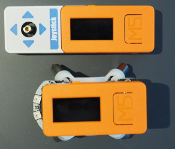
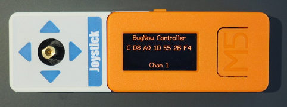
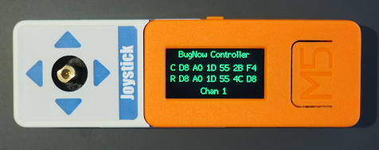
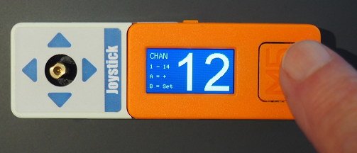
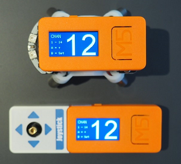
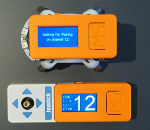
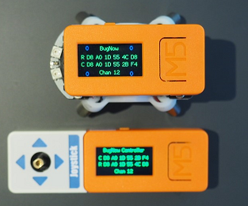

# BugC and BugController - A Pair of Projects for Controlling the M5StickC BugC Robot Hat

The [BugC](https://m5stack.com/collections/m5-hat/products/bugc-w-o-m5stickc) is a simple and inexpensive robot base for the [M5StickC](https://m5stack.com/collections/m5-hat/products/stick-c). Combined with another M5StickC sporting a [Joystick Hat](https://m5stack.com/collections/m5-hat/products/m5stickc-joystick-hat) you have the physical parts of a complete control system.

I had these parts on hand, and was curious about [ESP-Now](https://docs.espressif.com/projects/esp-idf/en/latest/esp32/api-reference/network/esp_now.html#esp-now), a protocol developed by Espressif Systems to provide direct communications between ESP32 and ESP8266 chips. This seemed like a perfect project for trying out something new.

ESP-Now turns out to be an interesting protocol. Advantages include:

* Connectionless. You don't need a network, just two or more devices.
* Simple. It takes a lot less programming than WiFi or Bluetooth.
* Fast. No discovery, connection, etc.
* It's extremely flexible.
* Surprise bonus: I read claims that you get three times the range. (I have not tested this, but sounds great for remote control.)

Limitations include:

* Non-routable protocol (for local use only, not for remote connections)
* 250 byte maximum payload - fine for light telemetry, not for general communications

## What's New

The original post of this code was poorly organized, but it's evolved. Since then I've broken the communications out to a library that contains of a class template called NowComm.h, implementing all the communications pairing and transactions but leaving the structure of the command as a template argument. This is intended to make implementing ESP-Now remote-control interfaces as simple as possible.  
Built on top of this is BugComm, a simple example of an extension of NowComm specialized for sending commands to the BugC.  
I hope to develop NowComm into a generally available library, but it's still pretty green. I'm sure there are still issues I haven't considered and I haven't even touched encryption yet. But I'd love to hear if anybody uses NowComm for their own project, and what suggestions they have for improvement.

## Prerequisites

* PlatformIO rather than the Arduino IDE. You can easily modify these projects to work on Arduino if you don't use PlatformIO; just change main.c to [ProjectName].ino and move everything to one folder per project.
* (2) M5StickCs: [ESP32-PICO Mini IoT Development Kits](https://m5stack.com/collections/m5-hat/products/stick-c)
* (1) BugC: [BugC Programmable Robot Base](https://m5stack.com/collections/m5-hat/products/bugc-w-o-m5stickc)
* (1) Joystick: [Joystick Hat](https://m5stack.com/collections/m5-hat/products/m5stickc-joystick-hat)
* (2) Projects: [BugC](https://github.com/vkichline/BugC) and [BugController](https://github.com/vkichline/BugController)
* Approximate cost if you live where I do and order directly from M5Stack in China, about $33.80.

    

## Setup

There are two modes of operation: Simple and Competition. The Simple mode makes pairing as simple as possible. Competition mode allows you to select one of 14 channels to operate on.

* Attach an M5StickC to your BugC when it arrives in the mail, turn the BugC switch on and plug the M5StickC in to charge over night before beginning. Its 750 mAh battery takes a while to charge up, and nothing works until it does.
* Compile the BugC project and upload it to the M5Stick attached to the BugC hat.
* Compile the BugController project and upload it to the M5StickC attached to the Joystick hat.
* Slide the slide-switch on the back of the BugC base to the right to turn on the BugC.

### Simple Mode

* Turn one of the devices on. It will display the device name, a letter describing its function (C for Controller and R for Receiver), the device's MAC address (six pairs of hexidecimal digits) and the channel in use (channel 1 for simple mode) all in red, indicating that the device is not yet paired.

    

* Turn on the other device. It will look similar to the first for a moment, then both should turn green and display two MAC addresses. This indicates that pairing is complete.

    

* The devices now display their names, the MAC address of C (the Controller), the MAC address of R (the receiver) and the channel in use. The Receiver also displays the motor speed of each motor: in green for forward, red for reverse and blue for full stop.
* You are paired and ready to go.

### Competition Mode

* Turn each M5StickCs on **while holding down the A button** (the big button with M5 written on it.)

    

* You will see a big number between 1 and 14 displayed at random on each device. This is the ESP-Now channel. Click the A button to advance the channel on one Stick or the other until they are both the same.

    

* Click the B button (the small button on the side, near the center of the LCD screen) on one device and then the other. As you click the first, the display will show "Waiting for Pairing on channel #". When you click B on the other device, they should pair almost instantly.

    

* The devices now display their names, the MAC address of C (the Controller), the MAC address of R (the receiver) and the channel in use. The Receiver also displays the motor speed of each motor: in green for forward, red for reverse and blue for full stop.

    

* You are paired and ready to go.

If the two devices do not pair, plug either back into the computer and use the serial monitor to see what errors are being displayed. Hopefully this will help indicate the cause of the problem.  
If the BugC pairs and shows different speed numbers when you move the Controller's joystick but there is no movement, make sure you turned on the BugC itself (it has a slide-switch which should be to the right) and that the base is fully charged.

Drive your BugC forward by pushing up on the joystick, backwards by pushing down. Left and right are, naturally, left and right.  
If you click the joystick, the red LED in the BugC's M5StickC will turn on as long as the joystick is pressed.  
If your BugController runs out of power while the BugC is running, pressing the A button (the big one with "M5" on it) on the BugC will stop the motors and turn off the lights.  

It's not a very accurate or powerful robot, but it's fun to play with. My cat does not fear it, but avoids its touch.
